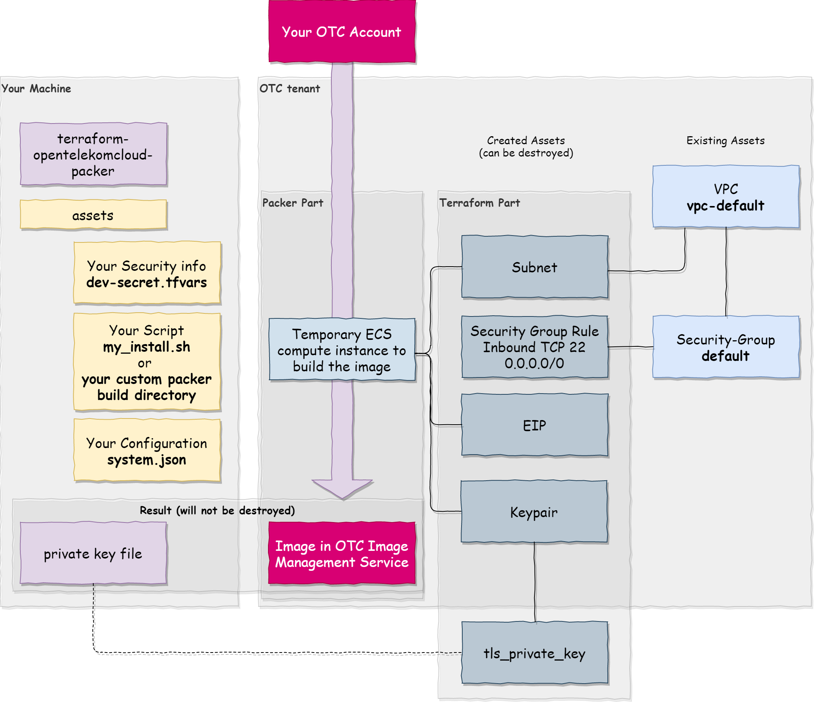

# terraform-opentelekomcloud-packer

Creates all resources to build an OTC private image and calls packer with the required configuration

## Need

Using packer with OTC comes with some prerequisites.

1. You need an already registered keypair within OTC, the private key of which you have access to locally.
2. You need an EIP already registered within OTC.
3. Your network needs to accept ssh acces, thus you will need a security group that allows inbound access via port 22.

## Solution 



All of the created artifacts are only needed for the time span that packer runs. Instead of doing all this work manually, this module manages everything for you. We will use the default VPC and borrow the default security group to temporarily attach a port 22 access.

(alternative idea for later: we could use terratest with calling packer from within the go test code)

## Configuration

I use a JSON file to do all my project configurations. IT is located in `assets\system.json`. Adopt to your needs. In this directory you find also the `dev-secret.tfvars` file template which you need to fill with your data. It is gitignored, so you should be safe here.

Two instantiate packer, you have two options:

1. set the `packer_template_directory` variable to a valid path. Then packer runs with that working directory. You have full control over the way packer is configured, but you have to set the account variables for yourself.

2. leave the `packer_template_directory` variable empty (default). Then packer uses an predefined environment which is only able to install a bash script on the target machine. You'll need to provide the script for your target image which will run with sudo. It is referenced in the `system.json`file. In this working mode, all the environment variables listed below are set to proper values.

### Environment Variables

```
# packer environment coming from built resources
TF_floating_ip = generated IP
TF_network = generated subnet
TF_source_image = identified ID of the base image
TF_ssh_keypair_name = generated keypair obkect

# packer environment coming from internal logic or from system.json
ENV_ssh_private_key_file = path where the generated key is to be stored
ENV_target_image_name = image of the generated target
ENV_ssh_username = user name to log on with
ENV_install_script_path = path to the bash script for working mode 2
ENV_wait_before_installing = seconds to wait before the install process starts

# credentials from secret.tfvars which allow sign-in to OTC.
OTC_identity_endpoint 
OTC_domain_name
OTC_tenant_name
OTC_region
OTC_availability_zone
OTC_username
OTC_password
```

## Run

Start the example from within the `example` directory. 

```
terraform apply -var-file="../assets/dev-secret.tfvars"
```

If successful you should get an image name, and the path to a local private key file. 

You can (and should) destroy the provisioned infrastructure immediately after the build. 

```
terraform destroy -var-file="../assets/dev-secret.tfvars" -auto-approve
```

The image will stay, as well as the local private key. You can delete the key, it was only needed for the build by packer.